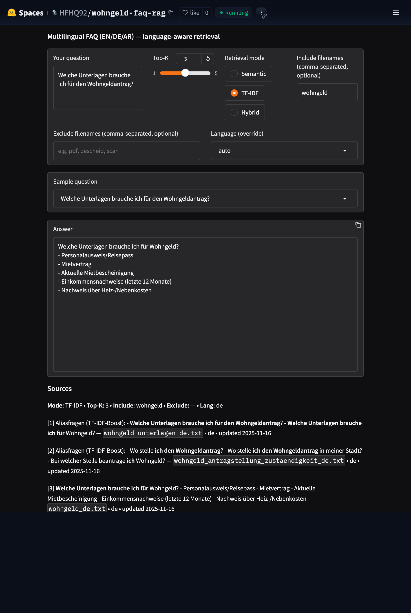

# Wohngeld FAQ RAG (DE/EN/AR)

[](https://huggingface.co/spaces/HFHQ92/wohngeld-faq-rag)
[](https://github.com/moe-eid-ml/p1-faq-rag/actions/workflows/ci.yml)



Compact RAG app for German **Wohngeld** questions. Dual retrievers (TF-IDF, Semantic) + Hybrid rerank. Gradio UI with in-app P@K/R@K evaluation. Deployed on Hugging Face.

## Multilingual FAQ RAG (EN/DE/AR)

Dual-mode retrieval (Semantic vs TF-IDF) with language gating, filename filters, and a metrics CLI.


## Features

- TF-IDF ↔ Semantic switch (MiniLM)
- Language auto-detect + override (de/en/ar)
- Filename **Include** filter (e.g., `faq`)
- Eval CLI: Precision@K / Recall@K
- Gradio UI

## Reliability (proof-driven)


- **Abstain on low confidence:** if retrieval is weak/ambiguous, the app returns “Insufficient evidence…” instead of guessing (and still shows top sources + reason).
- **Lightweight source pointer:** non-abstained answers end with ``Source: [n] (`filename`)`` to make provenance obvious.
- **CI regressions:** a fast **Smoke (fast)** job runs critical tests (abstain + source pointer) on every push/PR.

## Demo (60 seconds)

Run locally:

```bash
make run
```

Then try these in the UI:

1) **Normal question (answers + shows Source pointer)**
- Query: `Welche Unterlagen brauche ich für den Wohngeldantrag?`
- Expect: an answer ending with ``Source: [n] (`filename`)``

2) **Junk query (abstains instead of guessing)**
- Query: `asdf qwerty`
- Expect: “Insufficient evidence…” + Sources still shown + `Abstain: yes (...)`

3) **Filters + language control**
- Set **Include** → `wohngeld`
- Set **Language (override)** → `de`
- Query: `Wie lange dauert die Bearbeitung von Wohngeld?`
- Expect: German answer + clear sources

## Quickstart

```bash
python3 -m venv .venv && source .venv/bin/activate
python -m pip install -r requirements.txt
python app.py
```

## Results (FAQ subset)

- k=3, Include=faq
  - TF-IDF: **P@3 = 0.57**, **R@3 = 0.80**
  - Semantic: **P@3 = 0.33**, **R@3 = 1.00**
- k=1, Include=faq
  - TF-IDF: **P@1 = 0.80**, **R@1 = 0.80**
  - Semantic: **P@1 = 1.00**, **R@1 = 1.00**

```bash
python cli.py eval --both -k 3 --include faq
```

> **CI note:** In GitHub Actions, embeddings may be unavailable, so `semantic` and `hybrid` can fall back to TF-IDF and `--both` may show identical metrics in CI. Locally, install the semantic deps to enable true Semantic/Hybrid behavior.

## Wohngeld MVP (Multilingual)

- **Corpus:** `docs/wohngeld` (DE/EN/AR). Other texts archived and excluded from index.
- **Default mode:** Hybrid (RRF).
- **UI tip:** set **Include** → `wohngeld`; use **Language (override)** for strict DE/EN/AR.

### Eval — `data/wohngeld_eval.jsonl`

**k=3 (Include=wohngeld)**
- TF-IDF: **P@3 = 0.40**, **R@3 = 1.00**
- Semantic: **P@3 = 0.40**, **R@3 = 1.00**
- Hybrid: **P@3 = 0.40**, **R@3 = 1.00**

**k=1 (Include=wohngeld)**
- Hybrid: **P@1 = 0.80**, **R@1 = 0.70**

## Tooling (FAQ corpus / Arabic seed)

We use a small Typer CLI to keep the FAQ corpus clean and builds reproducible.

**Commands**
- `codex validate` — ensures Q/A are Arabic-only and blocks banned terms.
- `codex slugs` — enforces `slug__YYYY-MM-DD.txt` filenames.
- `codex embed` — builds `build/index.json` from `docs/faq/ar`.
- `codex sync` — validate → slugs → embed (one command).

**Dev/CI**
- Local guard: pre-commit runs `codex validate` on each commit.
- CI: `.github/workflows/faq-ci.yml` validates and builds on push/PR.

**Security hygiene**
- No secrets committed. Use `.env.example` (not `.env`).
- `.gitignore` excludes `.venv/`, `build/`, `__pycache__/`, `.pytest_cache/`.

## 📊 Current Metrics (2025-11-14)

Scope: **Include=wohngeld** • Eval file: `data/wohngeld_eval.jsonl`

- **P@1 (Hybrid, k=1):** 0.80
- **P@3 (k=3):**
  - **TF-IDF:** P@3 = 0.60 • R@3 ≈ 0.65
  - **Semantic:** P@3 ≈ 0.47 • R@3 ≈ 0.55–0.60
  - **Hybrid:** P@3 ≈ 0.47 • R@3 ≈ 0.55

Notes:
- Corpus: `docs/wohngeld/` (DE/EN/AR) + official DE PDF (sentence-aware paragraphs, ~200 chars on average (median 177; p90 355; max 531)).
- UI: TF-IDF default, Hybrid/Semantic available. Markdown sources with keyword highlights.
- Tools: in-app **Evaluate (P@K/R@K)**, **Reset filters**, CSV query logging.

## Development

```bash
# run locally
make run

# tests
make test

# fast regressions (abstain + source pointer)
make smoke

# quick eval (defaults K=3, Include=wohngeld)
make eval
make eval K=5 INCLUDE=wohngeld
```

## CLI (headless)

Query the app from the terminal without starting the UI.

```bash
# one-off
python ask.py -m TF-IDF -k 3 -i wohngeld "Welche Unterlagen brauche ich für den Wohngeldantrag?"

# with Make (defaults: MODE=TF-IDF, K=3, INCLUDE=wohngeld)
make ask Q="Welche Unterlagen brauche ich für den Wohngeldantrag?"
make ask Q="Bearbeitungszeit Wohngeld?" MODE=Hybrid K=5
```
