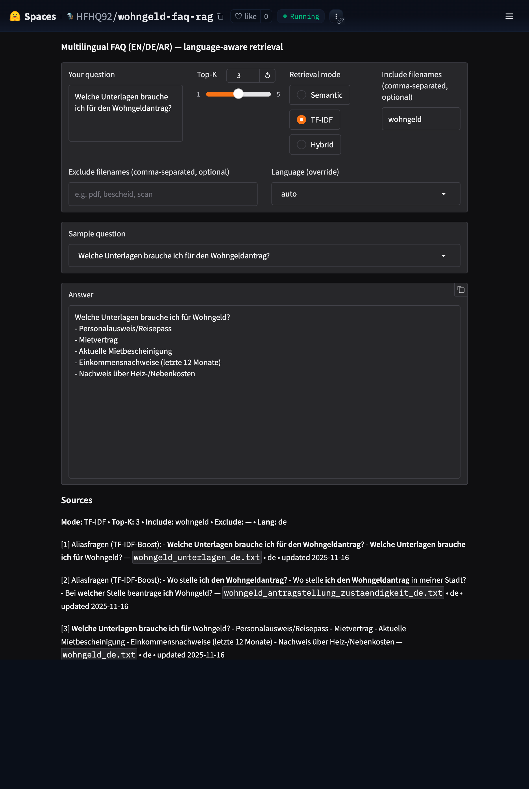

# Wohngeld FAQ RAG (DE/EN/AR)

[](https://huggingface.co/spaces/HFHQ92/wohngeld-faq-rag)
[](https://github.com/moe-eid-ml/p1-faq-rag/actions/workflows/ci.yml)

> **Project status (2026-07-01): wrapped at v0.1.4.** This repo contains **two complete
> learning projects**: the multilingual **Wohngeld FAQ RAG** app (this section) and
> **[KOSniper](#kosniper-v01)**, a fail-closed KO scanner for German tender PDFs.
> Both work, CI is green (274 tests), and no further work is planned — with one open
> decision: extending KOSniper with an LLM evidence checker. See
> [missions/MC-KOS-51-llm-evidence-checker.md](missions/MC-KOS-51-llm-evidence-checker.md).



Compact RAG app for German **Wohngeld** questions. Dual retrievers (TF-IDF, Semantic) + optional Hybrid fusion. Gradio UI with in-app evaluation + CLI eval. Deployed on Hugging Face.

## Multilingual FAQ RAG (EN/DE/AR)

Dual-mode retrieval (Semantic vs TF-IDF) with language gating, filename filters, and a metrics CLI.

## Project layout (source of truth)

- `app.py` — Gradio UI + core `answer()` flow (retrieval → abstain/clarify → cited output)
- `cli.py` / `ask.py` — headless evaluation + terminal querying
- `app_pkg/` — small shared utilities (e.g., language detection and source link building)
- `docs/` + `data/` — corpora + eval sets


## Features

- TF-IDF ↔ Semantic switch (MiniLM)
- Language auto-detect + override (de/en/ar)
- Filename **Include** filter (e.g., `faq`)
- Eval CLI: Precision@K / Recall@K

## Definition of Done (core “ready”)

*(Historical — this finish line was reached; repo wrapped at v0.1.4. See status banner above.)*

This project is considered **done** when:

- ✅ **Demo works:** HF Space loads and answers queries (no crashes).
- ✅ **CI is green:** `CI` + `FAQ Pipeline CI` pass on `main`.
- ✅ **Reproducible local run:** `make run`, `make ci`, `make smoke`, `make eval` all work on a clean clone.
- ✅ **Reliability guards:** nonsense → **Abstain**, topic-only → **Clarify**, normal → answer + `Source: [n]`.
- ✅ **Sources are inspectable:** Sources list includes `[view](...)` links (GitHub by default).
- ✅ **Privacy is explicit:** query logging is **opt-in** (default off; always off on HF Space).
- ✅ **Docs match reality:** README Quickstart + Demo steps reflect current behavior.

## Core TODO (finish line)

*(Historical — preserved as a record of the plan; no active work. See status banner above.)*

In priority order:

1) **Stability + UX**
   - Ensure the clarify “1–4 reply” flow works smoothly end-to-end in the UI.
   - Add a tiny “How to answer clarify” hint near the prompt (already documented in README).

2) **Evaluation + proof**
   - Keep `EVAL.md`/Results up to date with current corpus + defaults.
   - Keep smoke tests covering the top failure modes.

3) **Packaging polish**
   - Confirm fresh install steps (venv + requirements) and `make` targets stay consistent.
   - Keep CI using Makefile targets (no drift).

Extras (only after core is done): reranker, calibration/confidence score, FastAPI/Docker deployment, richer tracing UI.

## Reliability (proof-driven)


- **Abstain on low confidence:** if retrieval is weak/ambiguous, the app returns “Insufficient evidence…” instead of guessing (and still shows top sources + reason).
- **Clarify on too-broad queries:** for topic-only prompts (e.g., `Wohngeld`), the app asks what you mean (1–4). Reply with `1–4` (optionally with context) to auto-expand into a concrete query.
- **Lightweight source pointer:** non-abstained answers end with ``Source: [n] (`filename`)`` to make provenance obvious.
- **CI regressions:** a fast **Smoke (fast)** job runs critical tests (abstain + source pointer) on every push/PR.

## Demo (60 seconds)

Run locally:

```bash
make run
```

Then try these in the UI:

1) **Normal question (answers + shows Source pointer)**
- Query: `Welche Unterlagen brauche ich für den Wohngeldantrag?`
- Expect: an answer ending with ``Source: [n] (`filename`)``

2) **Junk query (abstains instead of guessing)**
- Query: `asdf qwerty`
- Expect: “Insufficient evidence…” + Sources still shown + `Abstain: yes (...)`

3) **Filters + language control**
- Set **Include** → `wohngeld`
- Set **Language (override)** → `de`
- Query: `Wie lange dauert die Bearbeitung von Wohngeld?`
- Expect: German answer + clear sources

4) **Broad query (asks to clarify) + reply shortcut**
- Query: `Wohngeld`
- Expect: a clarification prompt with options 1–4
- Then reply: `1 Berlin 2-person household`
- Expect: a normal answer (not the clarify prompt) ending with ``Source: [n] (`filename`)``

## Quickstart

```bash
python3 -m venv .venv && source .venv/bin/activate
python -m pip install -r requirements.txt
python app.py
```

## Results (FAQ subset)

- k=3, Include=faq
  - TF-IDF: **P@3 = 0.57**, **R@3 = 0.80**
  - Semantic: **P@3 = 0.33**, **R@3 = 1.00**
- k=1, Include=faq
  - TF-IDF: **P@1 = 0.80**, **R@1 = 0.80**
  - Semantic: **P@1 = 1.00**, **R@1 = 1.00**

```bash
python cli.py eval --both -k 3 --include faq
```

> **CI note:** In GitHub Actions, embeddings may be unavailable, so `semantic` and `hybrid` can fall back to TF-IDF and `--both` may show identical metrics in CI. Locally, install the semantic deps to enable true Semantic/Hybrid behavior.

## Wohngeld MVP (Multilingual)

- **Corpus:** `docs/wohngeld` (DE/EN/AR). Other texts archived and excluded from index.
- **Default mode:** TF-IDF (safe default).
- **UI tip:** set **Include** → `wohngeld`; use **Language (override)** for strict DE/EN/AR.

### Eval — `data/wohngeld_eval.jsonl`

**Snapshot (Include=wohngeld, queries=32)**

- **k=3**
  - **TF-IDF:** `file_r@3 = 0.84375` (DE `0.75`)
  - **Semantic:** `file_r@3 = 0.78125` (DE `0.65`)
  - **Hybrid:** `file_r@3 = 0.71875` (DE `0.55`)

- **k=5**
  - **TF-IDF:** `file_r@5 = 0.9375` (DE `0.90`)
  - **Semantic:** `file_r@5 = 0.84375` (DE `0.75`)
  - **Hybrid:** `file_r@5 = 0.8125` (DE `0.70`)

Run:
```bash
python cli.py eval --both -k 3 --include wohngeld
python cli.py eval --both -k 5 --include wohngeld
```

## Tooling (FAQ corpus / Arabic seed)

We use a small Typer CLI to keep the FAQ corpus clean and builds reproducible.

**Commands**
- `codex validate` — ensures Q/A are Arabic-only and blocks banned terms.
- `codex slugs` — enforces `slug__YYYY-MM-DD.txt` filenames.
- `codex embed` — builds `build/index.json` from `docs/faq/ar`.
- `codex sync` — validate → slugs → embed (one command).

**Dev/CI**
- Local guard: pre-commit runs `codex validate` on each commit.
- CI: `.github/workflows/faq-ci.yml` validates and builds on push/PR.

**Security hygiene**
- No secrets committed. Use `.env.example` (not `.env`).
- `.gitignore` excludes `.venv/`, `build/`, `__pycache__/`, `.pytest_cache/`.

## 📊 Current Metrics (2025-12-27)

Scope: **Include=wohngeld** • Eval file: `data/wohngeld_eval.jsonl` • Commit: `50c82f7`

Headline (file-level recall):
- **TF-IDF:** `file_r@3 = 0.84375`, `file_r@5 = 0.9375`
- **DE only:** `file_r@3 = 0.75`, `file_r@5 = 0.90`

Notes:
- Corpus: `docs/wohngeld/` (DE/EN/AR) + official DE PDF (sentence-aware paragraphs).
- UI: TF-IDF default; Hybrid/Semantic available.
- Sources: clickable links (GitHub by default; local via `/file=`).
- Tools: in-app **Evaluate (P@K/R@K)**, optional CSV query logging (opt-in; disabled by default / on HF Space).

## Development

```bash
# run locally
make run

# before pushing (lint + tests)
make ci

# optional: enable local query logging
# export LOG_QUERIES=1

# tests
make test

# fast regressions (abstain + source pointer)
make smoke

# quick eval (defaults K=3, Include=wohngeld)
make eval
make eval K=5 INCLUDE=wohngeld
```

## CLI (headless)

Query the app from the terminal without starting the UI.

```bash
# one-off
python ask.py -m TF-IDF -k 3 -i wohngeld "Welche Unterlagen brauche ich für den Wohngeldantrag?"

# with Make (defaults: MODE=TF-IDF, K=3, INCLUDE=wohngeld)
make ask Q="Welche Unterlagen brauche ich für den Wohngeldantrag?"
make ask Q="Bearbeitungszeit Wohngeld?" MODE=Hybrid K=5
```

## KOSniper (v0.1)

Bidder-side KO scanner for German public tenders. Proof-first, never false-green.

### Install & Run

```bash
# Install (makes `kosniper` command available)
pip install -e .

# Scan a PDF
kosniper --pdf tests/fixtures/fixture_ko_page2.pdf --scan        # RED
kosniper --pdf tests/fixtures/fixture_neutral.pdf --scan         # ABSTAIN

# Export report pack
kosniper --pdf tender.pdf --scan --out-dir ./report_pack

# Verify an existing report pack
kosniper --verify-pack --in-dir ./report_pack
```

**Fallback** (without install): `python -m kosniper.cli ...`

Or run `./scripts/demo.sh` to generate `evidence_pack.json`.

### Output Contract
- **Verdict:** `green` | `yellow` | `red` | `abstain` (never green without evidence)
- **Worst-check-wins:** overall_verdict = worst verdict across all checks
- **Offset basis:** when offsets exist, offset_basis must be set (standard: `normalized_text_v1`)
- **Deterministic CI:** `ruff check . && python -m compileall -q . && DISABLE_SEMANTIC=1 pytest -q`

### Real Usage
See [docs/REAL_USAGE.md](docs/REAL_USAGE.md) for copy-paste commands.

### Release
See `docs/RELEASE.md` for v1 criteria and release checklist.

## Start here
- [CLAUDE.md](CLAUDE.md) — single source of truth
- [docs/REAL_USAGE.md](docs/REAL_USAGE.md) — demo commands
- [HANDOFF.md](HANDOFF.md) — context (may be stale)
- [missions/MC-KOS-51-llm-evidence-checker.md](missions/MC-KOS-51-llm-evidence-checker.md) — the one open decision (LLM checker: go/no-go)
